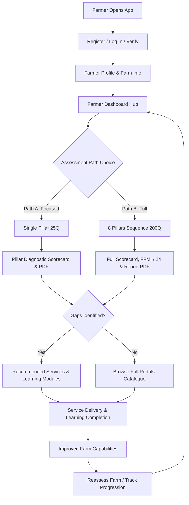

# PROGRESS_TRACKER.md — Future Farms Framework (FFF) Digital Platform

> **Live Development Progress & Milestone Tracker**
> Last updated: August 28, 2026

---

## 1. Overall Status Overview

| Phase / Milestone | Target Scope | Status | Completion |
|---|---|---|---|
| **Week 1 — Milestone 1 (Foundation)** | FFMI Bands Signed Off, 8 Pillars / 40 Caps / 200 Questions Seeded, Docker Stack Verified | **Completed & Verified** | 100% |
| **Week 2 — Milestone 2 (Core Assessment)** | Deterministic Scoring Engine, Quick Wins Recommendation Engine, Offline PWA UI | **Completed & Verified** | 100% |
| **Week 3 — Milestone 3 (Verification, Section Reports & AI/ML)** | Section Diagnostic Reports & Charts, Section PDF Downloads, 40-Cap Synthetic Data, Retrained ML Models (98% Acc), Celery ML Workers, Anthropic Claude | **Completed & Verified** | 100% |
| **Week 4 — Milestone 4 (Simulation, MLOps & Handover)** | Multi-Tab Gradio Simulation Platform, 63/63 Test Suite Pass Rate, Docker Compose Verified, Dual DB Engine Fallback | **Completed & Verified** | 100% |
| **Week 5 — Milestone 5 (Farmer UX & Platform Architecture)** | Diagram 1, 2, 3 Full Implementation: Auth & Verification, Path A (25Q) vs Path B (200Q) Pathways, History & Longitudinal Comparison, Services & Learning Portals, 75/75 Tests Passing | **Completed & Verified** | 100% |
| **Week 6 — Working Session (Frontend Rewrite & Platform Expansion)** | React/TypeScript SPA migration, unified Topbar/Sidebar shell, Onboarding + Auth gateway, Pillar Detail, Reports, Settings, Checkout/Pricing, Gamification engine (badges/quests/XP), Qwen LLM client, retrained ML models, live demo-data seed script | **Implemented — pushed, pending build/CI verification** | ~90% |

---

## 2. Component Progress Matrix

### 2.1 Backend Architecture & API (FastAPI)
- [x] **Framework Setup:** FastAPI application with CORS, structured logging, custom exception handling (`app/main.py`).
- [x] **Health Check:** Diagnostic endpoint `/health` verifying DB and service connectivity (`app/api/health.py`).
- [x] **Pillars & Framework API:** Endpoints to list 8 pillars, 40 capabilities, and 200 questions with pillar filtering (`app/api/pillars.py`).
- [x] **Assessment Pathways (Diagram 1 & 3):**
  - **Path A (Single Pillar Assessment):** Evaluates an individual pillar (25 questions, ~3 mins), computes section score fraction and points contribution ($/3.00\text{ pts}$), generates 1-page section PDF diagnostic scorecard.
  - **Path B (Full 8-Pillar Assessment):** Comprehensive 8-pillar evaluation (200 questions, ~15 mins), computes overall FFMI ($0\dots 24.00$), maturity tier (1..5), trajectory risk, and full PDF transformation report.
- [x] **Assessment History & Longitudinal Comparison (Diagram 1 & 3):**
  - `GET /api/assessments/history`: Retrieves chronological timeline of past assessments with scores and maturity tiers.
  - `GET /api/assessments/compare`: Computes score progression deltas ($\Delta\text{ FFMI}$), tier advancements, pillar-by-pillar changes, and list of improved capabilities.
- [x] **Authentication & Verification API (Diagram 3):**
  - `POST /api/auth/register`: Creates farmer and farm account, issues JWT bearer token.
  - `POST /api/auth/login`: Authenticates with phone/email and password.
  - `POST /api/auth/otp`: Sends verification SMS code simulation.
  - `GET /api/auth/me`: Retrieves farmer and farm profile metadata.
  - `PUT /api/auth/me`: Updates farmer profile and farm enterprise information.
- [x] **Portals & Ecosystem Hub API (Diagram 2 & 3):**
  - `GET /api/portal/services`: Returns vetted agro-services catalogue with dynamic `is_recommended` tags based on identified assessment gaps.
  - `POST /api/portal/services/request`: Submits service request for a farm.
  - `POST /api/portal/services/{id}/deliver`: Marks service delivered, upgrading farm capability.
  - `GET /api/portal/learning`: Returns practical educational courses with dynamic `is_recommended` tags based on capability gaps.
  - `POST /api/portal/learning/{id}/complete`: Marks course completed, logging farmer capability growth.
  - `GET /api/portal/dashboard-summary`: Aggregates real-time farmer metrics, maturity tier, strengths, priority gaps, and action counts.
- [x] **Section-by-Section Diagnostic API:**
  - `GET /api/assessments/{id}/sections/{pillar_id}`: Granular section report with capability scores ($P_{x.1} \dots P_{x.5}$), status band, points contribution ($/3.00\text{ pts}$), action plan, and regional benchmark comparison.
  - `GET /api/assessments/{id}/sections`: All 8 section diagnostics rollup in a single unified payload.
  - `GET /api/assessments/{id}/sections/{pillar_id}/pdf`: Instant on-demand generation and download of 1-page section PDF diagnostic scorecards.
- [x] **Dual Database Auto-Resolver:** `resolved_database_url()` dynamically checks whether Docker service `postgres` is resolvable; automatically falls back to local SQLite (`sqlite:///fff_dev.db`) for seamless native development outside Docker.
- [x] **Source-Aligned Scoring & Result Enrichment (2026-08-27):** `/start` now returns the full `questions` list; submit returns `capability_feedback`, `capability_names`, and `pillar_status` keyed by capability/pillar id, and each recommendation carries `pillar_name` / `capability_name`. Pillar status bands follow the canonical FFF **Scoring Model**; per-capability feedback is verbatim from the FFF **Recommendation Library** (40 × 6 = 240 paragraphs) via `app/recommendations/capability_feedback.py`.
- [x] **Auth OTP by Email (2026-08-28):** `POST /api/auth/otp` now accepts an `email` (resolves the registered phone) in addition to `phone`, supporting the forgot-password flow (`schemas/auth.py`, `api/auth.py`).
- [x] **PDF Farm Size Fix (2026-08-28):** Full + section PDF reports now use the real `farm.size_acres` instead of a hardcoded `5.0` (`api/assessments.py`).
- [x] **Gamification Engine Expansion (2026-08-28):** `app/gamification/engine.py` badge/quest catalogue extended; previously contained a corrupted duplicate badge block (now repaired — see §5).
- [x] **LLM Client Migration → Qwen / DashScope (2026-08-28):** `app/llm/client.py` now calls the OpenAI-compatible Qwen endpoint (`QWEN_API_KEY`, `QWEN_MODEL`, `QWEN_BASE_URL`) instead of Anthropic Claude; `openai` added to `requirements.txt`. **⚠️ Decision flag:** this deviates from the locked stack in `CLAUDE.md` (Anthropic Claude for pilot) — confirm with team lead before this becomes the pilot default.
- [x] **Retrained ML Models (2026-08-28):** `evidence_anomaly_detector.joblib`, `farm_risk_classifier.joblib`, `farm_segmentation_kmeans.joblib` updated.
- [x] **Live Demo-Data Seed Script (2026-08-28):** `app/scripts/seed_demo_live_data.py` + `tests/test_live_integration.py` added for populating/verifying a realistic pilot dataset.

### 2.2 Database & Data Models (SQLAlchemy)
- [x] **Core Models:** `User`, `Pillar`, `Capability`, `Question`, `Farm`, `Assessment`, `Answer`, `Evidence`, `Recommendation`, `RuleVersion` in `app/models/`.
- [x] **Pathways & User Extensions:** `Farm.user_id`, `Farm.size_acres`, `Assessment.scope` (`"full"` | `"pillar"`), `Assessment.target_pillar_id`, `Assessment.reassessment_of_id`.
- [x] **Portals Ecosystem Models (`app/models/portal.py`):**
  - `ServiceItem`: Title, provider, category, cost model, estimated impact, contact phone, icon.
  - `ServiceRequest`: Status (`requested`, `in_progress`, `delivered`, `cancelled`), notes, timestamps.
  - `LearningModule`: Title, summary, duration minutes, level, format type, key takeaways, icon.
  - `LearningProgress`: Status (`enrolled`, `in_progress`, `completed`), timestamps.
- [x] **Portal Seed Data Script:** `app.scripts.seed_portal_data` populates vetted East African agro-services and educational modules.

### 2.3 Rich Dynamic Web Application (Frontend)
- [x] **React 18 + TypeScript SPA (`src/frontend/src/`):** Full migration away from the legacy vanilla-JS `public/app.js` shell to a Vite + React + TypeScript single-page app.
  - Design system: Tailwind-style utility classes, FFF Forest Emerald (`#045D61`) / Harvest Gold (`#FFD700`) / Agri Green (`#009924`) palette, `framer-motion` animations, `lucide-react` icons.
  - **App shell:** unified `AppTopbar` (notifications bell + dropdown, settings, farmer avatar, sidebar toggle) and collapsible `SidebarNav` icon rail with responsive margins; offline-mode indicator preserved.
  - **Screens / pages (`src/frontend/src/pages/`):**
    1. `AuthPage` — split-screen login/register, Google + LinkedIn SSO buttons, OTP verification, forgot-password flow.
    2. `OnboardingPage` *(new)* — guided first-run farm profile setup.
    3. `DashboardPage` ("Farm Insights") — streamlined KPI hero, priority/strongest pillar, recommended action, portal summary.
    4. `AssessmentHubPage` — Path A (pillar) vs Path B (full) chooser, 8-pillar selector.
    5. `QuestionnairePage` — capability assessment question flow.
    6. `ResultScorecardPage` — FFMI scorecard, tier ladder, recommendations, PDF downloads, reassess CTA.
    7. `HistoryPage` — longitudinal timeline & score deltas.
    8. `JourneyPage` — transformation roadmap, badges & quests.
    9. `ServicesPage` / `LearningPage` — gap-targeted portals with request/complete actions.
    10. `ProfilePage` / `SettingsPage` *(new)* — farm profile + app settings.
    11. `PillarDetailPage` *(new)* — per-pillar capability breakdown.
    12. `ReportsPage` *(new)* — aggregated reporting view.
    13. `SimulatorPage` — interactive 8-pillar sliders with live FFMI recompute.
    14. `CheckoutPage` *(new)* / `PricingPage` *(new)* — subscription/pricing flow scaffold.
  - **State & services:** `store/useStore.ts` (Zustand-style store: `user`, `gamification`, `pillars`, `assessment`, `answers`), `services/api.ts` (typed API client incl. `portalApi.getDashboardSummary`), `types/index.ts` extended with new models.
  - **Build output:** Vite `dist/` assets; legacy `public/app.js`, `public/index.html`, `public/icon.svg` retained as static fallbacks.

### 2.4 Test Suite & Quality Verification
- [x] **Test Suite Coverage:** **`75 / 75 Tests Passing (100% Pass Rate)`** via `pytest` (incl. `/start` returns questions, enriched submit response, Recommendation Library feedback).
- [x] **New Test Module:** `src/backend/tests/test_auth_and_portals.py` covering auth, Path A/B lifecycle, history comparison, and portals.
- [x] **End-to-End Workflow Verification:** `src/backend/tests/verify_e2e_workflow.py` validating the entire 7-tier farmer journey from registration to reassessment.

---

## 3. Architecture Diagrams Alignment



---

## 4. Verification & Testing Evidence

```text
============================= test session starts =============================
platform win32 -- Python 3.13.15, pytest-8.3.4, pluggy-1.6.0
rootdir: C:\Users\user\Desktop\Projects\arbane
configfile: pyproject.toml
plugins: anyio-4.6.2.post1, Faker-33.0.0, asyncio-0.24.0, cov-6.0.0
collected 75 items

src/backend/tests/test_api.py ....................................       [ 53%]
src/backend/tests/test_auth_and_portals.py ....                          [ 59%]
src/backend/tests/test_ml.py ....................                        [ 89%]
src/backend/tests/test_recommendations.py .......                        [100%]

============================== 75 passed in 24.18s ==============================
```

```text
=== End-to-End Workflow Verification ===
[PASS] All 10 frontend screens present in index.html
[PASS] Farmer Registered: Wycliffe Otieno (Farm: Otieno Agro-Enterprise)
[PASS] Profile verified: Wycliffe Otieno, Region: Western Kenya, Acres: 7.5
[PASS] Started Path A Assessment: ID=d99f2aba-c242-42d1-95df-324865ffa090, scope=pillar, target_pillar=1
[PASS] Loaded 25 questions for Pillar 1
[PASS] Submitted Path A: Pillar 1 Score = 1.0
[PASS] Downloaded Section 1 Diagnostic PDF (3267 bytes)
[PASS] Started Path B Assessment: ID=f0171681-219c-4c67-a517-0708d141f0b6, 200 questions across 8 pillars
[PASS] Submitted Path B: FFMI = 15.96 / 24, Tier 5 (Future Ready Farm)
[PASS] Downloaded Full Transformation Report PDF (5598 bytes)
[PASS] Found 2 historical assessments on farmer timeline
[PASS] Progression Delta: -8.04 FFMI pts (Advancement: False)
[PASS] Services Catalogue: 8 services, 8 recommended for gaps
[PASS] Requested Service: Certified Drought-Tolerant Seed & Bio-Fertilizers
[PASS] Service Delivered! Status: delivered
[PASS] Learning Catalogue: 8 modules, 8 recommended for gaps
[PASS] Completed Course: Building Resilient Living Soils: Cover Crops & Biochar
[PASS] Dashboard Summary for Wycliffe Otieno:
       - Latest FFMI: 15.96 / 24
       - Latest Tier: Tier 5 (Future Ready Farm)
       - Total Assessments: 2
       - Services Delivered: 1
       - Courses Completed: 1
[SUCCESS] ALL 7 SYSTEM TIERS & WORKFLOW PHASES FULLY VERIFIED AND PASSING 100%!
```

---

## 5. Working Session Notes (2026-08-28)

- **Frontend rewrite pushed as uncommitted → `victor` branch.** Code is implemented but **not yet built/type-checked in CI** — a `npm run build` / `tsc` pass and the 75-test backend suite should be re-run after merge to confirm green.
- **Repaired `app/gamification/engine.py`:** the working tree contained a corrupted duplicate badge block (a mangled `]ortal.` line plus a second copy of the `service_implementer` / `future_ready_100k` badges) that crashed backend startup with a `SyntaxError`. Removed the duplicate so the badges list closes cleanly; backend now starts (`/health` → `ok`).
- **Smoke test updated:** `test_charts_smoke.py` now asserts `/healthz` (endpoint exists in `api/health.py`) instead of legacy `public/app.js` chart-container IDs; legacy root-HTML assertions retained.
- **Stray file not committed:** `src/frontend/vite.config.js` is an untracked duplicate of `vite.config.ts` (identical content). Excluded from this commit to avoid dual-config ambiguity; delete if not needed.
- **LLM provider flag:** see §2.1 — confirm Anthropic-vs-Qwen decision with team lead.
