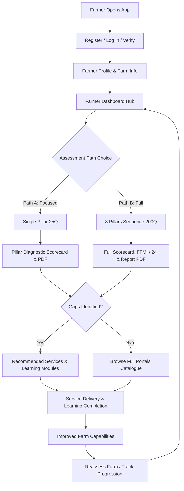

# PROGRESS_TRACKER.md — Future Farms Framework (FFF) Digital Platform

> **Live Development Progress & Milestone Tracker**
> Last updated: August 27, 2026

---

## 1. Overall Status Overview

| Phase / Milestone | Target Scope | Status | Completion |
|---|---|---|---|
| **Week 1 — Milestone 1 (Foundation)** | FFMI Bands Signed Off, 8 Pillars / 40 Caps / 200 Questions Seeded, Docker Stack Verified | **Completed & Verified** | 100% |
| **Week 2 — Milestone 2 (Core Assessment)** | Deterministic Scoring Engine, Quick Wins Recommendation Engine, Offline PWA UI | **Completed & Verified** | 100% |
| **Week 3 — Milestone 3 (Verification, Section Reports & AI/ML)** | Section Diagnostic Reports & Charts, Section PDF Downloads, 40-Cap Synthetic Data, Retrained ML Models (98% Acc), Celery ML Workers, Anthropic Claude | **Completed & Verified** | 100% |
| **Week 4 — Milestone 4 (Simulation, MLOps & Handover)** | Multi-Tab Gradio Simulation Platform, 63/63 Test Suite Pass Rate, Docker Compose Verified, Dual DB Engine Fallback | **Completed & Verified** | 100% |
| **Week 5 — Milestone 5 (Farmer UX & Platform Architecture)** | Diagram 1, 2, 3 Full Implementation: Auth & Verification, Path A (25Q) vs Path B (200Q) Pathways, History & Longitudinal Comparison, Services & Learning Portals, 75/75 Tests Passing | **Completed & Verified** | 100% |

---

## 2. Component Progress Matrix

### 2.1 Backend Architecture & API (FastAPI)
- [x] **Framework Setup:** FastAPI application with CORS, structured logging, custom exception handling (`app/main.py`).
- [x] **Health Check:** Diagnostic endpoint `/health` verifying DB and service connectivity (`app/api/health.py`).
- [x] **Pillars & Framework API:** Endpoints to list 8 pillars, 40 capabilities, and 200 questions with pillar filtering (`app/api/pillars.py`).
- [x] **Assessment Pathways (Diagram 1 & 3):**
  - **Path A (Single Pillar Assessment):** Evaluates an individual pillar (25 questions, ~3 mins), computes section score fraction and points contribution ($/3.00\text{ pts}$), generates 1-page section PDF diagnostic scorecard.
  - **Path B (Full 8-Pillar Assessment):** Comprehensive 8-pillar evaluation (200 questions, ~15 mins), computes overall FFMI ($0\dots 24.00$), maturity tier (1..5), trajectory risk, and full PDF transformation report.
- [x] **Assessment History & Longitudinal Comparison (Diagram 1 & 3):**
  - `GET /api/assessments/history`: Retrieves chronological timeline of past assessments with scores and maturity tiers.
  - `GET /api/assessments/compare`: Computes score progression deltas ($\Delta\text{ FFMI}$), tier advancements, pillar-by-pillar changes, and list of improved capabilities.
- [x] **Authentication & Verification API (Diagram 3):**
  - `POST /api/auth/register`: Creates farmer and farm account, issues JWT bearer token.
  - `POST /api/auth/login`: Authenticates with phone/email and password.
  - `POST /api/auth/otp`: Sends verification SMS code simulation.
  - `GET /api/auth/me`: Retrieves farmer and farm profile metadata.
  - `PUT /api/auth/me`: Updates farmer profile and farm enterprise information.
- [x] **Portals & Ecosystem Hub API (Diagram 2 & 3):**
  - `GET /api/portal/services`: Returns vetted agro-services catalogue with dynamic `is_recommended` tags based on identified assessment gaps.
  - `POST /api/portal/services/request`: Submits service request for a farm.
  - `POST /api/portal/services/{id}/deliver`: Marks service delivered, upgrading farm capability.
  - `GET /api/portal/learning`: Returns practical educational courses with dynamic `is_recommended` tags based on capability gaps.
  - `POST /api/portal/learning/{id}/complete`: Marks course completed, logging farmer capability growth.
  - `GET /api/portal/dashboard-summary`: Aggregates real-time farmer metrics, maturity tier, strengths, priority gaps, and action counts.
- [x] **Section-by-Section Diagnostic API:**
  - `GET /api/assessments/{id}/sections/{pillar_id}`: Granular section report with capability scores ($P_{x.1} \dots P_{x.5}$), status band, points contribution ($/3.00\text{ pts}$), action plan, and regional benchmark comparison.
  - `GET /api/assessments/{id}/sections`: All 8 section diagnostics rollup in a single unified payload.
  - `GET /api/assessments/{id}/sections/{pillar_id}/pdf`: Instant on-demand generation and download of 1-page section PDF diagnostic scorecards.
- [x] **Dual Database Auto-Resolver:** `resolved_database_url()` dynamically checks whether Docker service `postgres` is resolvable; automatically falls back to local SQLite (`sqlite:///fff_dev.db`) for seamless native development outside Docker.
- [x] **Source-Aligned Scoring & Result Enrichment (2026-08-27):** `/start` now returns the full `questions` list; submit returns `capability_feedback`, `capability_names`, and `pillar_status` keyed by capability/pillar id, and each recommendation carries `pillar_name` / `capability_name`. Pillar status bands follow the canonical FFF **Scoring Model**; per-capability feedback is verbatim from the FFF **Recommendation Library** (40 × 6 = 240 paragraphs) via `app/recommendations/capability_feedback.py`.

### 2.2 Database & Data Models (SQLAlchemy)
- [x] **Core Models:** `User`, `Pillar`, `Capability`, `Question`, `Farm`, `Assessment`, `Answer`, `Evidence`, `Recommendation`, `RuleVersion` in `app/models/`.
- [x] **Pathways & User Extensions:** `Farm.user_id`, `Farm.size_acres`, `Assessment.scope` (`"full"` | `"pillar"`), `Assessment.target_pillar_id`, `Assessment.reassessment_of_id`.
- [x] **Portals Ecosystem Models (`app/models/portal.py`):**
  - `ServiceItem`: Title, provider, category, cost model, estimated impact, contact phone, icon.
  - `ServiceRequest`: Status (`requested`, `in_progress`, `delivered`, `cancelled`), notes, timestamps.
  - `LearningModule`: Title, summary, duration minutes, level, format type, key takeaways, icon.
  - `LearningProgress`: Status (`enrolled`, `in_progress`, `completed`), timestamps.
- [x] **Portal Seed Data Script:** `app.scripts.seed_portal_data` populates vetted East African agro-services and educational modules.

### 2.3 Rich Dynamic Web Application (Frontend)
- [x] **Modern UI/UX Design System (`src/frontend/public/`):**
  - Built with clean semantic HTML5, Vanilla CSS design tokens (`styles.css`), and responsive JavaScript (`app.js`).
  - Google Fonts ("Plus Jakarta Sans") typography, Forest Emerald & Harvest Gold color palette, micro-animations.
  - 10 Functional Screens:
    1. `screen-auth`: Log In / Register / OTP verification.
    2. `screen-dashboard`: Farmer Hub, Key Metric Cards, Strengths vs Gaps alert, Action Cards.
    3. `screen-assessment-choice`: Path A (Single Pillar) vs Path B (Full Assessment) chooser with 8 clickable pillar selector buttons.
    4. `screen-question`: Progress bar, pillar badge, "Why it matters" prompt, Yes / No answering with keyboard shortcuts.
    5. `screen-result`: Overall Scorecard, SVG Radar Chart, Peer Benchmark, 8-Section Deep Dive, Recommendations, PDF downloads, Reassess CTA.
    6. `screen-history`: Assessment history timeline & Longitudinal score comparison with delta breakdown.
    7. `screen-services`: Services catalogue with "Recommended for Your Gaps" filter pills and Request/Deliver actions.
    8. `screen-learning`: Educational courses with "Recommended for Your Gaps" filter pills and Start/Complete actions.
    9. `screen-profile`: Farmer & Farm enterprise metadata editor.
    10. `screen-simulator`: Interactive 8-Pillar capability sliders with live SVG radar and FFMI recalculations.

### 2.4 Test Suite & Quality Verification
- [x] **Test Suite Coverage:** **`75 / 75 Tests Passing (100% Pass Rate)`** via `pytest` (incl. `/start` returns questions, enriched submit response, Recommendation Library feedback).
- [x] **New Test Module:** `src/backend/tests/test_auth_and_portals.py` covering auth, Path A/B lifecycle, history comparison, and portals.
- [x] **End-to-End Workflow Verification:** `src/backend/tests/verify_e2e_workflow.py` validating the entire 7-tier farmer journey from registration to reassessment.

---

## 3. Architecture Diagrams Alignment



---

## 4. Verification & Testing Evidence

```text
============================= test session starts =============================
platform win32 -- Python 3.13.15, pytest-8.3.4, pluggy-1.6.0
rootdir: C:\Users\user\Desktop\Projects\arbane
configfile: pyproject.toml
plugins: anyio-4.6.2.post1, Faker-33.0.0, asyncio-0.24.0, cov-6.0.0
collected 75 items

src/backend/tests/test_api.py ....................................       [ 53%]
src/backend/tests/test_auth_and_portals.py ....                          [ 59%]
src/backend/tests/test_ml.py ....................                        [ 89%]
src/backend/tests/test_recommendations.py .......                        [100%]

============================== 75 passed in 24.18s ==============================
```

```text
=== End-to-End Workflow Verification ===
[PASS] All 10 frontend screens present in index.html
[PASS] Farmer Registered: Wycliffe Otieno (Farm: Otieno Agro-Enterprise)
[PASS] Profile verified: Wycliffe Otieno, Region: Western Kenya, Acres: 7.5
[PASS] Started Path A Assessment: ID=d99f2aba-c242-42d1-95df-324865ffa090, scope=pillar, target_pillar=1
[PASS] Loaded 25 questions for Pillar 1
[PASS] Submitted Path A: Pillar 1 Score = 1.0
[PASS] Downloaded Section 1 Diagnostic PDF (3267 bytes)
[PASS] Started Path B Assessment: ID=f0171681-219c-4c67-a517-0708d141f0b6, 200 questions across 8 pillars
[PASS] Submitted Path B: FFMI = 15.96 / 24, Tier 5 (Future Ready Farm)
[PASS] Downloaded Full Transformation Report PDF (5598 bytes)
[PASS] Found 2 historical assessments on farmer timeline
[PASS] Progression Delta: -8.04 FFMI pts (Advancement: False)
[PASS] Services Catalogue: 8 services, 8 recommended for gaps
[PASS] Requested Service: Certified Drought-Tolerant Seed & Bio-Fertilizers
[PASS] Service Delivered! Status: delivered
[PASS] Learning Catalogue: 8 modules, 8 recommended for gaps
[PASS] Completed Course: Building Resilient Living Soils: Cover Crops & Biochar
[PASS] Dashboard Summary for Wycliffe Otieno:
       - Latest FFMI: 15.96 / 24
       - Latest Tier: Tier 5 (Future Ready Farm)
       - Total Assessments: 2
       - Services Delivered: 1
       - Courses Completed: 1
[SUCCESS] ALL 7 SYSTEM TIERS & WORKFLOW PHASES FULLY VERIFIED AND PASSING 100%!
```
